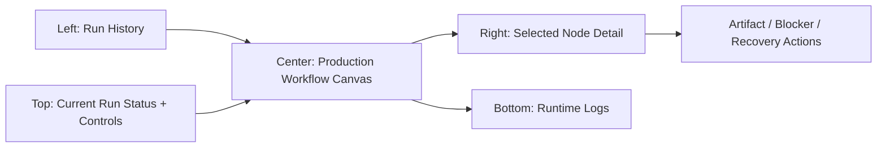

# Unified Workflow Center Implementation Plan

> **For agentic workers:** REQUIRED SUB-SKILL: Use superpowers:subagent-driven-development (recommended) or superpowers:executing-plans to implement this plan task-by-task. Steps use checkbox (`- [ ]`) syntax for tracking.

**Goal:** Merge the confusing `运行监控` and `流程编排` tabs into one workflow page where history, node canvas, status, artifacts, blockers, and recovery actions all describe the same selected pipeline run.

**Architecture:** Keep backend APIs unchanged and use the existing production workflow adapter as the single source for canvas runs. Remove the separate monitor-stage canvas from `WorkflowStudio.jsx`; always render the real production workflow nodes and load run history through `/api/workflows/runs`, which already maps persisted pipeline runs into workflow run objects.

**Tech Stack:** React, Vite, `@xyflow/react`, lucide-react, Node.js CommonJS backend adapters, `node:test`.

---

## Current Problem

The page currently has two conceptual modes:

- `MODE_MONITOR`: shows a read-only stage funnel built from `MONITOR_STAGES`.
- `MODE_EXPERIMENT`: shows the actual production workflow nodes, node details, artifacts, blockers, and recovery buttons.

This creates two mental models for one pipeline. Users have to decide whether to use `运行监控` or `流程编排`, even though both are looking at the same run. Antigravity agreed this should become one page centered on the real production workflow topology.

---

## Target Information Architecture



### Left Sidebar

- Remove the `运行监控 / 流程编排` toggle.
- Keep one `运行历史` list.
- Use `/api/workflows/runs` only for the list because it already returns workflow-shaped pipeline runs through `listWorkflowRuns()`.
- Each history item shows:
  - `runId`
  - localized status
  - current stage or selected active node
  - updated time

### Center Canvas

- Remove `MONITOR_STAGES`, `MONITOR_EDGES`, and the monitor React Flow instance.
- Always render the production workflow nodes from `run.workflow.nodes` or the daily production template.
- Node cards keep existing progress, status chip, blocker callout, and action chip behavior.
- Selecting a node drives the right panel.

### Right Detail Panel

- Remove the separate monitor detail branch.
- Always show selected production node details:
  - status
  - progress
  - blocker reason
  - action hint
  - recovery action cards
  - artifact panel
- If no node is selected, show a run summary card and prompt the user to select a node.

### Top Toolbar

- Show one current status badge from `runStatus`.
- Show current `runId`.
- Keep production actions:
  - `运行工作流`
  - `暂停`
  - `取消运行`
  - recovery actions remain in the node detail panel.

---

## File Structure

- Modify `apps/web/src/workflow-ui.js`
  - Add helpers for unified history labels and active-node selection.
- Modify `apps/web/src/workflow-ui.test.mjs`
  - Cover the new helpers and protect against monitor-mode vocabulary leaking back.
- Modify `apps/web/src/WorkflowStudio.jsx`
  - Remove mode toggle, monitor-only state, monitor canvas, and monitor detail panel.
  - Keep one history list, one production canvas, one selected-node detail panel.
- Modify `apps/web/src/App.jsx`
  - Change `WorkflowStudio` usage so it no longer passes `initialMode`.
- Modify `apps/web/src/App.css`
  - Remove or leave unused mode-toggle styling; add any small unified-history styles only if needed.

No backend route changes are planned.

---

### Task 1: Pure Helpers for Unified Run Display

**Files:**
- Modify: `apps/web/src/workflow-ui.js`
- Test: `apps/web/src/workflow-ui.test.mjs`

- [ ] **Step 1: Add failing tests**

Append to `apps/web/src/workflow-ui.test.mjs`:

```js
test('getWorkflowRunActiveNodeId picks the most useful selected node from a run', () => {
  assert.equal(getWorkflowRunActiveNodeId({
    runtime: { activeStep: 'verify' },
    nodeStates: {
      mine: { status: 'completed' },
      verify: { status: 'blocked' }
    }
  }), 'verify');

  assert.equal(getWorkflowRunActiveNodeId({
    nodeStates: {
      mine: { status: 'completed' },
      verify: { status: 'completed' },
      generate: { status: 'running' }
    }
  }), 'generate');

  assert.equal(getWorkflowRunActiveNodeId({
    nodeStates: {
      start: { status: 'completed' },
      mine: { status: 'idle' }
    }
  }), 'start');
});

test('getUnifiedWorkflowHistoryItem describes workflow runs without monitor vocabulary', () => {
  const item = getUnifiedWorkflowHistoryItem({
    runId: '2026-07-06-005614',
    status: 'blocked',
    stage: 'verified',
    updatedAt: '2026-07-06T00:56:14.000Z',
    nodeStates: {
      verify: { status: 'blocked' }
    }
  });

  assert.equal(item.runId, '2026-07-06-005614');
  assert.equal(item.statusLabel, '已阻塞');
  assert.equal(item.subtitle, '生意参谋校验');
  assert.equal(item.visualState, 'failed');
  assert.equal(item.typeLabel, '生产流程');
});
```

Also add these imports:

```js
  getWorkflowRunActiveNodeId,
  getUnifiedWorkflowHistoryItem,
```

- [ ] **Step 2: Run tests and verify failure**

Run:

```bash
node --test apps/web/src/workflow-ui.test.mjs
```

Expected: FAIL because the two helpers are not exported.

- [ ] **Step 3: Implement helper functions**

Add to `apps/web/src/workflow-ui.js`:

```js
const PRODUCTION_NODE_LABELS = {
  start: '开始',
  mine: '选词挖掘',
  verify: '生意参谋校验',
  generate: '标题生成',
  export: '导出清单',
  review: '人工复核',
  end: '完成'
};

export function getWorkflowRunActiveNodeId(run = {}) {
  if (run.runtime?.activeStep) return run.runtime.activeStep;
  const nodeStates = run.nodeStates || {};
  const priority = ['blocked', 'failed', 'waiting_manual', 'retryable', 'paused', 'running', 'needs_review', 'waiting_confirmation'];
  for (const status of priority) {
    const found = Object.entries(nodeStates).find(([, state]) => state?.status === status);
    if (found) return found[0];
  }
  const completed = Object.entries(nodeStates).reverse().find(([, state]) => state?.status === 'completed');
  return completed ? completed[0] : 'start';
}

export function getUnifiedWorkflowHistoryItem(run = {}) {
  const activeNodeId = getWorkflowRunActiveNodeId(run);
  const status = run.status || 'unknown';
  const visualState = ['blocked', 'failed'].includes(status)
    ? 'failed'
    : ['paused', 'waiting_manual', 'retryable'].includes(status)
      ? 'paused'
      : ['completed', 'workflow_complete'].includes(status)
        ? 'completed'
        : status === 'running'
          ? 'running'
          : 'idle';
  return {
    runId: run.runId || '',
    status,
    statusLabel: labelWorkflowNodeStatus(status),
    subtitle: PRODUCTION_NODE_LABELS[activeNodeId] || activeNodeId || '生产流程',
    updatedAt: run.updatedAt || run.startedAt || '',
    visualState,
    typeLabel: '生产流程'
  };
}
```

- [ ] **Step 4: Run tests**

Run:

```bash
node --test apps/web/src/workflow-ui.test.mjs
```

Expected: PASS.

- [ ] **Step 5: Commit**

```bash
git add apps/web/src/workflow-ui.js apps/web/src/workflow-ui.test.mjs
git commit -m "feat: add unified workflow run helpers"
```

---

### Task 2: Remove Mode Toggle and Use One History List

**Files:**
- Modify: `apps/web/src/WorkflowStudio.jsx`
- Modify: `apps/web/src/App.jsx`
- Test: `apps/web/src/workflow-ui.test.mjs`

- [ ] **Step 1: Update imports**

In `apps/web/src/WorkflowStudio.jsx`, remove unused monitor imports after the refactor:

```js
  getPipelineMonitorNodeStatus,
  getPipelineSummaryVisualState,
```

Add:

```js
  getUnifiedWorkflowHistoryItem,
  getWorkflowRunActiveNodeId,
```

- [ ] **Step 2: Remove mode constants and state**

Delete:

```js
const MODE_MONITOR = 'monitor';
const MODE_EXPERIMENT = 'experiment';
const MONITOR_STAGES = [...]
const MONITOR_EDGES = ...
```

Change component signature:

```jsx
export default function WorkflowStudio({ onNavigate }) {
```

Remove:

```js
const [mode, setMode] = useState(initialMode);
const [selectedMonitorNodeId, setSelectedMonitorNodeId] = useState('seed');
const [monitorRuns, setMonitorRuns] = useState([]);
const [monitorLatestRun, setMonitorLatestRun] = useState(null);
const [monitorLoading, setMonitorLoading] = useState(false);
const [monitorError, setMonitorError] = useState('');
const [selectedMonitorRunId, setSelectedMonitorRunId] = useState(null);
const [selectedMonitorRun, setSelectedMonitorRun] = useState(null);
```

- [ ] **Step 3: Simplify data loading**

Replace the mode-dependent effects with a single startup effect:

```js
useEffect(() => {
  fetchTemplates();
  fetchHistoryRuns();
}, []);
```

Keep `fetchHistoryRuns()` as the only history loader. After it receives runs, if there is no `currentRunId`, load the latest run:

```js
const fetchHistoryRuns = async () => {
  try {
    const res = await fetch('/api/workflows/runs?limit=20');
    const payload = await res.json();
    const runs = normalizeRunList(payload);
    setHistoryRuns(runs);
    if (!currentRunId && runs[0]?.runId) {
      await loadHistoryRun(runs[0].runId);
    }
  } catch (err) {
    console.error('获取运行历史失败', err);
  }
};
```

If closure dependencies become awkward, split auto-load into a second `useEffect`:

```js
useEffect(() => {
  if (!currentRunId && historyRuns[0]?.runId) loadHistoryRun(historyRuns[0].runId);
}, [currentRunId, historyRuns]);
```

- [ ] **Step 4: Remove the left mode toggle UI**

Delete the two buttons:

```jsx
<button onClick={() => setMode(MODE_MONITOR)}>运行监控</button>
<button onClick={() => setMode(MODE_EXPERIMENT)}>流程编排</button>
```

Replace the header subtitle with:

```jsx
<div className="text-[11px] text-slate-500">运行历史、节点状态与处理动作</div>
```

- [ ] **Step 5: Render one history list**

Replace the `mode === MODE_MONITOR ? ... : ...` history block with:

```jsx
<div className="space-y-2">
  <button
    onClick={fetchHistoryRuns}
    className="w-full py-2 rounded border border-slate-700 bg-slate-800 hover:bg-slate-700 text-xs text-slate-200 font-semibold flex items-center justify-center gap-1.5"
  >
    <RefreshCw size={13} /> 刷新历史
  </button>
  {historyRuns.length === 0 ? (
    <div className="text-xs text-slate-500 italic p-2">暂无流程运行记录</div>
  ) : (
    <div className="space-y-1.5">
      {historyRuns.map((run) => {
        const item = getUnifiedWorkflowHistoryItem(run);
        return (
          <button
            key={item.runId}
            onClick={() => loadHistoryRun(item.runId)}
            className={`monitor-run-card ${currentRunId === item.runId ? 'monitor-run-card-active' : ''}`}
          >
            <div className="flex justify-between items-center font-mono text-[10px] text-slate-400 mb-1">
              <span className="truncate w-36">{item.runId}</span>
              <span className={`monitor-status-pill monitor-status-${item.visualState}`}>
                {item.statusLabel}
              </span>
            </div>
            <div className="font-semibold text-slate-200 truncate">{item.subtitle}</div>
            <div className="text-[10px] text-slate-500 mt-1">{formatDateTime(item.updatedAt)}</div>
          </button>
        );
      })}
    </div>
  )}
</div>
```

- [ ] **Step 6: Update App usage**

In `apps/web/src/App.jsx`, change:

```jsx
<WorkflowStudio key={activeTab} initialMode="monitor" onNavigate={setActiveTab} />
```

to:

```jsx
<WorkflowStudio key={activeTab} onNavigate={setActiveTab} />
```

- [ ] **Step 7: Run build**

Run:

```bash
npm run web:build
```

Expected: PASS.

- [ ] **Step 8: Commit**

```bash
git add apps/web/src/WorkflowStudio.jsx apps/web/src/App.jsx
git commit -m "refactor: unify workflow history view"
```

---

### Task 3: Replace Monitor Canvas With Production Workflow Canvas

**Files:**
- Modify: `apps/web/src/WorkflowStudio.jsx`

- [ ] **Step 1: Remove monitor canvas variables**

Delete:

```js
const activeMonitorSummary = ...
const activeMonitorAction = ...
const selectedMonitorStage = ...
const monitorNodes = useMemo(...)
```

Keep:

```js
const isRunActive = runStatus === 'running' || runStatus === 'pending';
const canCancelRun = Boolean(currentRunId) && isRunActive;
const canPauseRun = Boolean(currentRunId) && runStatus === 'running';
```

- [ ] **Step 2: Simplify top toolbar**

Replace the mode-dependent status badge with:

```jsx
<span className={`px-2 py-0.5 rounded-full text-[10px] font-bold uppercase ${
  runStatus === 'completed' ? 'bg-emerald-500/10 text-emerald-400' :
  runStatus === 'failed' ? 'bg-rose-500/10 text-rose-400' :
  runStatus === 'blocked' ? 'bg-amber-500/10 text-amber-300' :
  runStatus === 'cancelled' ? 'bg-amber-500/10 text-amber-400' :
  runStatus === 'running' ? 'bg-blue-500/10 text-blue-400 animate-pulse' : 'bg-slate-800 text-slate-400'
}`}>
  {labelWorkflowNodeStatus(runStatus)}
</span>
```

Always show:

```jsx
{currentRunId && <span className="text-xs font-mono text-slate-500">RunId: {currentRunId}</span>}
```

- [ ] **Step 3: Always render the production ReactFlow**

Replace:

```jsx
{mode === MODE_MONITOR ? <ReactFlow ... monitorNodes ... /> : <ReactFlow ... nodes ... />}
```

with the production canvas only:

```jsx
<ReactFlow
  key="workflow-production-flow"
  nodes={nodes}
  edges={edges}
  onNodesChange={onNodesChange}
  onEdgesChange={onEdgesChange}
  onConnect={onConnect}
  onNodeClick={onNodeClick}
  nodeTypes={nodeTypes}
  defaultViewport={{ x: 0, y: 0, zoom: 0.82 }}
  minZoom={0.5}
  maxZoom={1.5}
  style={{ width: '100%', height: '100%' }}
>
  <Background color="#334155" gap={20} size={1} />
  <Controls className="bg-slate-900 border border-slate-800 text-slate-100 rounded" />
  <MiniMap
    bgColor="#0f172a"
    nodeColor={(n) => {
      if (isInputNodeType(n.type)) return '#3b82f6';
      if (n.type === 'keyword-mining') return '#6366f1';
      if (n.type === 'title-generator') return '#10b981';
      return '#64748b';
    }}
    maskColor="rgba(15, 23, 42, 0.6)"
  />
</ReactFlow>
```

- [ ] **Step 4: Keep the console visible**

Remove `mode === MODE_EXPERIMENT &&` around the bottom console panel so logs are always visible.

- [ ] **Step 5: Select active node when loading a run**

At the end of `loadHistoryRun(runId)`, after `setNodes(...)`, set:

```js
setSelectedNodeId(getWorkflowRunActiveNodeId(run));
```

This makes the right panel immediately useful after clicking history.

- [ ] **Step 6: Build**

Run:

```bash
npm run web:build
```

Expected: PASS.

- [ ] **Step 7: Commit**

```bash
git add apps/web/src/WorkflowStudio.jsx
git commit -m "refactor: use production canvas as workflow center"
```

---

### Task 4: Merge the Right Panel Into One Node Detail Panel

**Files:**
- Modify: `apps/web/src/WorkflowStudio.jsx`
- Modify: `apps/web/src/workflow-ui.js`
- Test: `apps/web/src/workflow-ui.test.mjs`

- [ ] **Step 1: Remove monitor detail branch**

Delete the full:

```jsx
{mode === MODE_MONITOR ? (...) : selectedNode ? (...)}
```

Replace with:

```jsx
{selectedNode ? (
  <div className="p-5 flex-1 overflow-y-auto space-y-6">
    ...
  </div>
) : (
  <div className="p-5 flex-grow flex flex-col justify-center items-center text-slate-500 text-xs italic text-center">
    <Settings size={28} className="text-slate-700 mb-2 animate-pulse" />
    请选择中间画布中的节点，以查看状态、产物、阻塞原因和处理动作。
  </div>
)}
```

- [ ] **Step 2: Rename panel heading**

Change:

```jsx
{mode === MODE_MONITOR ? '流程详情' : '属性配置面板'}
```

to:

```jsx
节点详情
```

- [ ] **Step 3: Make configuration controls read-only for loaded runs**

Define:

```js
const isDraftWorkflow = !currentRunId;
```

For every right-panel input, add:

```jsx
disabled={!isDraftWorkflow}
```

This applies to keyword, daily params, mining count, title length, and label.

- [ ] **Step 4: Hide destructive draft-only actions for loaded runs**

Only show delete selected when draft:

```jsx
{isDraftWorkflow && selectedNodeId && (...删除选中...)}
```

Only show node library and templates when draft:

```jsx
{isDraftWorkflow && (...节点库...)}
{isDraftWorkflow && templates.length > 0 && (...模板...)}
```

- [ ] **Step 5: Update empty artifact wording**

In `apps/web/src/workflow-ui.js`, change:

```js
return { kind: 'empty', emptyText: '运行完成后显示产物，请到运行监控查看。', rows: [], text: '' };
```

to:

```js
return { kind: 'empty', emptyText: '运行完成后会在这里显示节点产物。', rows: [], text: '' };
```

Add test:

```js
test('getWorkflowArtifactView uses unified page wording for empty artifacts', () => {
  assert.equal(getWorkflowArtifactView(null, 'mine').emptyText, '运行完成后会在这里显示节点产物。');
});
```

- [ ] **Step 6: Test and build**

Run:

```bash
node --test apps/web/src/workflow-ui.test.mjs
npm run web:build
```

Expected: PASS.

- [ ] **Step 7: Commit**

```bash
git add apps/web/src/WorkflowStudio.jsx apps/web/src/workflow-ui.js apps/web/src/workflow-ui.test.mjs
git commit -m "refactor: merge workflow detail panel"
```

---

### Task 5: Remove Dead Monitor Code and CSS

**Files:**
- Modify: `apps/web/src/WorkflowStudio.jsx`
- Modify: `apps/web/src/App.css`

- [ ] **Step 1: Search for monitor-only symbols**

Run:

```bash
rg -n "MODE_MONITOR|MODE_EXPERIMENT|MONITOR_STAGES|MONITOR_EDGES|selectedMonitor|monitorNodes|monitorLatest|monitorRuns|monitorLoading|monitorError|运行监控|流程编排" apps/web/src/WorkflowStudio.jsx apps/web/src/App.css
```

Expected before cleanup: matches exist.

- [ ] **Step 2: Remove monitor-only functions**

Delete functions that only support the removed monitor view:

```js
getSummaryVisualState
resolveSummaryStageIndex
getMonitorNodeStatus
loadWorkbenchRuns
loadWorkbenchRunDetail
```

Keep shared helpers if still referenced elsewhere.

- [ ] **Step 3: Remove unused imports**

Run:

```bash
npm run web:build
```

Fix any Vite errors for unused or missing imports.

- [ ] **Step 4: Remove or leave harmless CSS**

Remove only CSS that is clearly unused after searching:

```bash
rg -n "mode-toggle|monitor-stage|workflow-monitor|monitor-detail" apps/web/src
```

Do not remove shared classes such as `monitor-run-card` or `monitor-status-pill` if the unified history still uses them.

- [ ] **Step 5: Verify no user-facing old labels remain**

Run:

```bash
rg -n "运行监控|流程编排|只读监控|请到运行监控" apps/web/src
```

Expected: no matches.

- [ ] **Step 6: Commit**

```bash
git add apps/web/src/WorkflowStudio.jsx apps/web/src/App.css
git commit -m "chore: remove split workflow modes"
```

---

### Task 6: Browser Verification

**Files:**
- No source edits expected.

- [ ] **Step 1: Run focused tests**

```bash
node --test apps/web/src/workflow-ui.test.mjs core/test/workflow-pipeline-adapter.test.js
```

Expected: PASS.

- [ ] **Step 2: Run build**

```bash
npm run web:build
```

Expected: PASS.

- [ ] **Step 3: Start UI**

```bash
npm run ui
```

Open:

```text
http://127.0.0.1:3001/
```

- [ ] **Step 4: Verify unified page**

Browser checks:

- The workflow page has no `运行监控` / `流程编排` toggle.
- Left sidebar has one `运行历史` list.
- Clicking run `2026-07-06-005614` loads the production node canvas.
- The canvas shows nodes such as `开始`, `选词挖掘`, `生意参谋校验`.
- The right panel automatically selects the active blocked node or lets the user select a node.
- Selecting `开始` shows `开始节点没有产物。`.
- Selecting `选词挖掘` shows candidate cards, not raw JSON.
- Selecting `生意参谋校验` shows `阻塞原因：验真无结果` and the action cards.
- No raw `IDLE`, `VERIFIED_EMPTY`, `运行监控`, `流程编排`, or `请到运行监控` appears.

- [ ] **Step 5: Stop UI server**

Stop the `npm run ui` process with Ctrl-C.

- [ ] **Step 6: Push**

```bash
git status --short --branch
git push
```

Expected: only local runtime cache such as `data/platform-access/` remains untracked.

---

## Risk Notes From Antigravity Review

- **History format mismatch:** Prefer `/api/workflows/runs` because the backend adapter already maps pipeline runs into workflow-shaped objects. Avoid merging raw `/api/pipeline/current` data unless a missing history case is proven.
- **SSE state drift:** When loading a running run, always call `listenToRunEvents(runId)` so node progress stays live.
- **Artifact request race:** Keep the existing `cancelled` guard in the artifact effect so rapid node switching does not render stale artifacts.
- **Draft vs run editing:** Treat loaded historical runs as read-only. Keep editable node parameters only for future draft creation, not for already persisted runs.
- **Scope control:** Do not redesign backend workflow execution in this pass.

---

## Self-Review

- Spec coverage: Covers information architecture, history, canvas, detail panel, cleanup, testing, and browser verification.
- Placeholder scan: No open-ended TODOs or undefined helper names remain; helper names are introduced before use.
- Type consistency: Uses existing `runId`, `runStatus`, `nodeStates`, `selectedNodeId`, `currentRunId`, `nodes`, and `edges` naming from `WorkflowStudio.jsx`.
