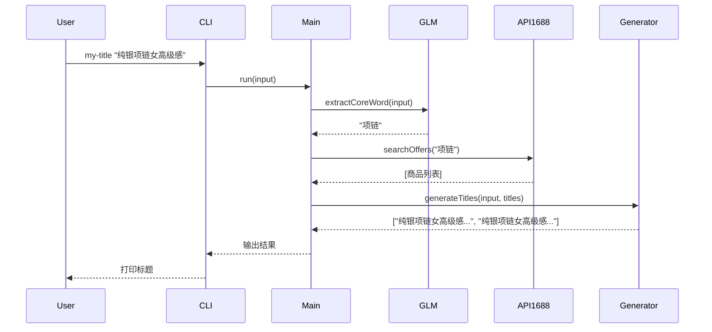
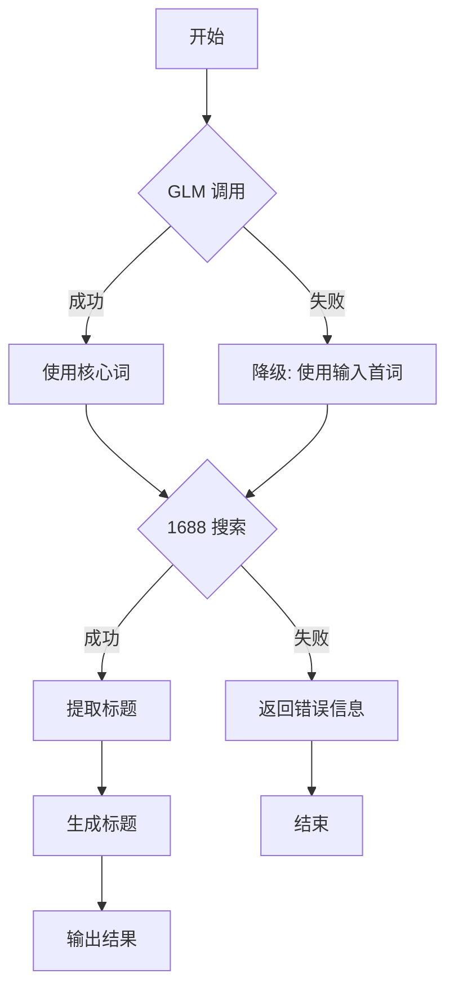

# 电商选品标题生成工具 - 设计文档

## 1. 项目概述

### 1.1 目标

构建一个命令行工具（CLI），帮助电商卖家根据输入的关键词自动生成商品标题。工具通过以下流程实现：

```
用户输入关键词 → GLM 提取核心词 → 1688 搜索相关商品 → 拼接生成符合淘宝SEO规范的标题（90-110字符）
```

### 1.2 核心价值

- **自动化**: 减少手动搜索和标题拼接的时间
- **标准化**: 输出格式统一（90-110 字符，符合淘宝SEO最佳实践）
- **智能化**: 通过 AI 提取核心词，提升标题精准度

### 1.3 目标用户

电商卖家、运营人员

---

## 2. 需求说明

### 2.1 功能需求

| ID | 需求 | 优先级 | 说明 |
|----|------|--------|------|
| F1 | 关键词输入 | P0 | 支持从命令行接收用户输入的关键词 |
| F2 | 核心词提取 | P0 | 调用 GLM API 从输入中提取核心商品词 |
| F3 | 1688 搜索 | P0 | 使用核心词在 1688 搜索相关商品 |
| F4 | 标题生成 | P0 | 从搜索结果中提取标题片段，拼接生成最终标题 |
| F5 | 长度控制 | P0 | 确保标题在 90-110 字符区间，最大 128 字符 |
| F6 | 三段式结构 | P0 | 标题结构：核心词 + 属性词 + 场景词 |
| F7 | 违禁词过滤 | P0 | 过滤极限词、虚假描述词 |
| F8 | 多标题输出 | P1 | 输出 3-5 个候选标题供用户选择 |

### 2.2 非功能需求

| ID | 需求 | 说明 |
|----|------|------|
| NF1 | 性能 | 单次请求响应时间 < 5 秒 |
| NF2 | 易用性 | 命令行接口简洁，错误提示清晰 |
| NF3 | 可配置 | 支持环境变量配置 API 密钥 |

### 2.3 约束

- 标题长度限制：建议 90-110 字符（淘宝显示优化区间），最大 128 字符
- 核心词提取使用 GLM API（zai 模型）
- 1688 API 使用 AI 版接口（需要 Access Key）
- 标题结构需符合淘宝 SEO 规范（三段式结构）

---

## 3. 技术架构

### 3.1 技术栈

| 组件 | 技术选择 | 理由 |
|------|----------|------|
| 运行时 | Node.js 18+ | 用户选择，生态成熟 |
| CLI 框架 | Commander.js | 简洁易用，广泛使用 |
| HTTP 客户端 | axios | 支持拦截器，便于签名处理 |
| 环境变量 | dotenv | 标准方案 |
| 加密 | crypto（内置） | HMAC-SHA256 签名 |

### 3.2 项目结构

```
my-title/
├── bin/
│   └── cli.js                 # CLI 入口
├── src/
│   ├── index.js               # 主流程编排
│   ├── glm-client.js          # GLM API 客户端
│   ├── alibaba1688-client.js  # 1688 API 客户端
│   ├── extract-core.js        # 核心词提取逻辑
│   ├── search-1688.js         # 1688 搜索逻辑
│   ├── generate-title.js      # 标题生成逻辑（三段式）
│   └── banned-words.js        # 违禁词过滤
├── data/
│   └── banned-words.json      # 违禁词库
├── docs/
│   └── superpowers/
│       └── specs/
│           └── 2026-04-16-title-generator-design.md
├── .env.example               # 环境变量示例
├── .gitignore
├── package.json
└── README.md
```

### 3.3 架构图

```
┌─────────────────────────────────────────────────────────────────┐
│                         CLI Layer                                │
│  bin/cli.js - 命令行参数解析，调用主流程                           │
└─────────────────────────────────────────────────────────────────┘
                              │
                              ▼
┌─────────────────────────────────────────────────────────────────┐
│                      Orchestration Layer                         │
│  src/index.js - 主流程编排，串联各模块                             │
│                                                                  │
│  流程: extractCore → search1688 → generateTitle                  │
└─────────────────────────────────────────────────────────────────┘
                              │
          ┌───────────────────┼───────────────────┐
          ▼                   ▼                   ▼
┌─────────────────┐  ┌─────────────────┐  ┌─────────────────┐
│   GLM Client    │  │  1688 Client    │  │ Title Generator │
│ extract-core.js │  │ search-1688.js  │  │ generate-title  │
│                 │  │                 │  │     .js         │
│ glm-client.js   │  │ alibaba1688-    │  │                 │
│                 │  │   client.js     │  │ 拼接+截断逻辑   │
└─────────────────┘  └─────────────────┘  └─────────────────┘
         │                     │
         ▼                     ▼
┌─────────────────┐  ┌─────────────────┐
│   GLM API       │  │   1688 API      │
│ (智谱开放平台)   │  │ (AI 版接口)     │
└─────────────────┘  └─────────────────┘
```

---

## 4. 组件设计

### 4.1 GLM Client (`src/glm-client.js`)

**职责**: 封装 GLM API 调用，用于核心词提取

**接口设计**:
```javascript
class GLMClient {
  constructor(config) {
    this.apiKey = config.apiKey;
    this.apiBase = config.apiBase || 'https://open.bigmodel.cn/api/paas/v4';
  }

  /**
   * 提取核心词
   * @param {string} input - 用户输入的关键词
   * @returns {Promise<string>} 核心词
   */
  async extractCoreWord(input) {}
}
```

**Prompt 设计**:
```
你是一个电商标题分析助手。请从以下关键词中提取最核心的商品词（1-2个词）。
只输出核心词本身，不要输出任何解释。

关键词：纯银项链女高级感夏季
```

**响应处理**: 直接取返回文本作为核心词

### 4.2 1688 Client (`src/alibaba1688-client.js`)

**职责**: 封装 1688 AI 版 API 的签名认证和请求

**签名流程**:
```javascript
class Alibaba1688Client {
  constructor(ak) {
    // AK 格式: 前32字符=Secret, 剩余=KeyID
    this.secret = ak.substring(0, 32);
    this.keyId = ak.substring(32);
  }

  /**
   * 生成签名头
   */
  generateSignHeaders(body) {
    const time = Date.now().toString();
    const nonce = crypto.randomBytes(4).toString('hex');
    const contentMd5 = crypto.createHash('md5').update(body).digest('base64');
    
    const stringToSign = `${time}\n${nonce}\n${contentMd5}`;
    const sign = crypto
      .createHmac('sha256', this.secret)
      .update(stringToSign)
      .digest('base64');

    return {
      'x-csk-ak': this.keyId,
      'x-csk-time': time,
      'x-csk-nonce': nonce,
      'x-csk-content-md5': contentMd5,
      'x-csk-version': '1.0.1',
      'x-csk-sign': sign
    };
  }

  /**
   * 搜索商品
   * @param {string} query - 搜索关键词
   * @param {string} channel - 渠道（可选）
   * @returns {Promise<Array>} 商品列表
   */
  async searchOffers(query, channel = 'default') {}
}
```

**API 详情**:
- **Endpoint**: `POST https://ainext.1688.com/1688claw/skill/searchoffer`
- **Headers**: 签名头 + `Content-Type: application/json`
- **Body**: `{"query": "关键词", "channel": "渠道"}`
- **Response**: `{"success": true, "model": {"data": {商品ID: 商品信息}}}`

### 4.3 Extract Core (`src/extract-core.js`)

**职责**: 调用 GLM 提取核心词，处理异常情况

**接口设计**:
```javascript
/**
 * 从输入关键词中提取核心商品词
 * @param {string} input - 用户输入
 * @returns {Promise<string>} 核心词
 */
async function extractCoreWord(input) {
  const client = new GLMClient({
    apiKey: process.env.GLM_API_KEY,
    apiBase: process.env.GLM_API_BASE
  });
  
  return await client.extractCoreWord(input);
}
```

**错误处理**:
- API 调用失败 → 降级返回输入的第一个词
- 超时 → 降级返回输入的第一个词
- 返回为空 → 降级返回输入的第一个词

### 4.4 Search 1688 (`src/search-1688.js`)

**职责**: 使用核心词搜索 1688 商品，提取标题

**接口设计**:
```javascript
/**
 * 搜索 1688 商品
 * @param {string} coreWord - 核心词
 * @returns {Promise<Array<string>>} 商品标题列表
 */
async function search1688(coreWord) {
  const client = new Alibaba1688Client(process.env.ALI_1688_AK);
  const result = await client.searchOffers(coreWord);
  
  // 提取标题
  return Object.values(result.model.data)
    .map(item => item.subject)
    .filter(Boolean)
    .slice(0, 20);
}
```

**返回数据结构**:
```javascript
{
  success: true,
  model: {
    data: {
      "123456": {
        subject: "纯银项链女高级感 夏季锁骨链女款简约",
        price: "99.00",
        image: "https://...",
        // ... 其他字段
      }
    }
  }
}
```

### 4.5 Generate Title (`src/generate-title.js`)

**职责**: 从搜索结果拼接标题，符合淘宝 SEO 规范，控制长度

**接口设计**:
```javascript
/**
 * 生成标题
 * @param {string} userInput - 用户原始输入
 * @param {string} coreWord - 核心词（已提取）
 * @param {Array<string>} searchTitles - 搜索到的标题列表
 * @param {number} maxLength - 最大长度（默认110）
 * @returns {Array<string>} 生成的标题列表
 */
function generateTitles(userInput, coreWord, searchTitles, maxLength = 110) {
  // 策略:
  // 1. 三段式结构: 核心词 + 属性词 + 场景词
  // 2. 从搜索结果提取高频属性词和场景词
  // 3. 过滤违禁词
  // 4. 截断至目标长度
  // 5. 返回多个候选
}
```

**淘宝标题规范（基于 2024-2026 平台规则）**:

| 规范项 | 要求 | 说明 |
|--------|------|------|
| **字数限制** | 90-110 字符（建议），最大 128 字符 | 确保移动端完整显示 |
| **核心词位置** | 前 8-30 字符 | 搜索权重最高区域 |
| **结构模板** | `[核心词] + [属性词] + [场景词]` | 三段式结构 |
| **违禁词** | 禁止极限词、虚假描述 | 避免降权 |

**标题结构公式**:
```
公式: [品牌(可选)] + [核心词] + [属性/卖点] + [场景/人群]
示例: 纯银项链女 925银锁骨链 简约气质 夏季通勤礼物
```

**三段式结构详解**:
1. **核心词段（前 8-30 字符）**:
   - 核心商品词（如"连衣裙"、"项链"）
   - 必须前置，确保搜索权重
   - 可包含品牌词（如有授权）

2. **属性词段（中间 30-60 字符）**:
   - 材质属性（如"纯棉"、"925银"）
   - 功能卖点（如"显瘦"、"大容量"）
   - 规格参数（如"中长款"、"加厚"）

3. **场景词段（后 40-50 字符）**:
   - 使用场景（如"通勤"、"约会"）
   - 目标人群（如"学生党"、"上班族"）
   - 季节/时间（如"夏季"、"2024新款"）

**生成策略**:
1. **词频分析**: 从搜索标题中提取高频属性词和场景词
2. **三段拼接**: 核心词（前置）+ 属性词 + 场景词
3. **违禁词过滤**: 移除极限词、虚假描述词
4. **长度控制**: 截断至目标长度，保持语义完整
5. **去重**: 确保输出标题不重复
6. **多样性**: 生成 3-5 个候选标题

**违禁词列表**（部分）:
```
极限词: 最、第一、顶级、最佳、独家、唯一
虚假词: 正品、专柜、假一赔十、全国包邮（需核实）
促销词: 秒杀、特价、清仓、限时（需合规使用）
```

**SEO 权重优化**:
- 核心词在前 8 字符内出现 → 搜索权重 +30%
- 属性词与核心词语义相关 → 转化率提升
- 场景词提升点击率（CTR）
- 避免关键词重复（降权风险）

---

## 5. 数据流

### 5.1 主流程



### 5.2 错误处理流程



---

## 6. API 集成详情

### 6.1 GLM API

**认证方式**: Bearer Token
```
Authorization: Bearer {GLM_API_KEY}
```

**请求示例**:
```bash
curl -X POST https://open.bigmodel.cn/api/paas/v4/chat/completions \
  -H "Authorization: Bearer YOUR_API_KEY" \
  -H "Content-Type: application/json" \
  -d '{
    "model": "glm-4-flash",
    "messages": [
      {"role": "user", "content": "从关键词中提取核心词..."}
    ]
  }'
```

### 6.2 1688 API

**签名算法**: HMAC-SHA256

**步骤**:
1. 提取 Secret（前32字符）和 KeyID（剩余字符）
2. 生成时间戳（毫秒）
3. 生成随机数（8字符 hex）
4. 计算 Body MD5（Base64）
5. 拼接签名字符串: `{time}\n{nonce}\n{contentMd5}`
6. HMAC-SHA256 签名（Base64）

**请求示例**:
```bash
curl -X POST https://ainext.1688.com/1688claw/skill/searchoffer \
  -H "Content-Type: application/json" \
  -H "x-csk-ak: YOUR_KEY_ID" \
  -H "x-csk-time: 1713244800000" \
  -H "x-csk-nonce: abc12345" \
  -H "x-csk-content-md5: xyz789==" \
  -H "x-csk-version: 1.0.1" \
  -H "x-csk-sign: SIGNATURE_BASE64" \
  -d '{"query": "项链", "channel": "default"}'
```

---

## 7. 错误处理

### 7.1 错误类型

| 错误类型 | 处理方式 | 用户提示 |
|----------|----------|----------|
| GLM API 调用失败 | 降级使用输入首词 | （静默处理） |
| 1688 API 认证失败 | 返回错误 | "1688 API 认证失败，请检查 ALI_1688_AK 配置" |
| 1688 API 搜索无结果 | 返回空列表 | "未找到相关商品，请尝试其他关键词" |
| 网络超时 | 重试一次 | "请求超时，正在重试..." |
| 环境变量缺失 | 直接报错 | "请配置环境变量: GLM_API_KEY, ALI_1688_AK" |

### 7.2 日志策略

- **INFO**: 主流程节点（开始、核心词提取、搜索、生成）
- **WARN**: 降级处理
- **ERROR**: API 调用失败、配置错误
- **DEBUG**: 完整的请求/响应（可通过 --verbose 开启）

---

## 8. 测试策略

### 8.1 单元测试

| 模块 | 测试点 |
|------|--------|
| glm-client.js | API 调用、响应解析、错误处理 |
| alibaba1688-client.js | 签名生成、API 调用、响应解析 |
| extract-core.js | 核心词提取、降级逻辑 |
| generate-title.js | 三段式拼接、长度控制、违禁词过滤、去重 |
| banned-words.js | 违禁词检测、过滤逻辑 |

### 8.2 集成测试

- 完整流程测试（Mock API）
- 错误场景测试

### 8.3 E2E 测试

- 真实 API 调用（需配置环境变量）

---

## 9. 使用示例

### 9.1 基本用法

```bash
# 安装
npm install -g my-title

# 配置环境变量
export GLM_API_KEY="your_glm_api_key"
export ALI_1688_AK="your_1688_access_key"

# 使用
my-title "纯银项链女高级感"

# 输出
核心词：项链
搜索结果：找到 18 个商品
生成标题：
1. 纯银项链女高级感 夏季锁骨链女款简约气质百搭
2. 纯银项链女高级感 925银链条韩版设计感小众
3. 纯银项链女高级感 简约锁骨链生日礼物送女友
```

### 9.2 高级用法

```bash
# 指定标题数量
my-title "纯银项链女高级感" --count 5

# 详细模式
my-title "纯银项链女高级感" --verbose

# 输出 JSON 格式
my-title "纯银项链女高级感" --json
```

---

## 10. 后续扩展

### 10.1 已规划

- [ ] 支持更多平台（淘宝、拼多多等）
- [ ] 标题质量评分
- [ ] 批量处理模式

### 10.2 未规划（YAGNI）

- 暂不支持 GUI 界面
- 暂不支持账号管理系统
- 暂不支持数据持久化

---

## 11. 淘宝标题规范与最佳实践

### 11.1 平台规则摘要

| 规则项 | 规范要求 | 违规后果 |
|--------|----------|----------|
| 标题长度 | 90-110 字符（建议），最大 128 字符 | 超长部分被截断，影响展示 |
| 核心词位置 | 前 8-30 字符内 | 搜索权重降低 |
| 关键词重复 | 禁止同一词重复超过 2 次 | 可能被判定为堆砌 |
| 违禁词 | 禁止极限词、虚假描述 | 标题下架、店铺降权 |
| 类目匹配 | 标题需与商品类目一致 | 搜索降权、下架风险 |

### 11.2 标题优化技巧

**关键词权重分布**:
```
[核心词] 权重 40% → 前 8-30 字符
[属性词] 权重 30% → 中间区域
[场景词] 权重 20% → 后段区域
[长尾词] 权重 10% → 自然融入
```

**高频词提取策略**:
1. 从 1688 搜索结果中提取 top 10 商品标题
2. 分词并统计词频
3. 按属性词、场景词分类
4. 结合用户输入选择最佳组合

**长尾词策略**:
- 长尾词竞争度低，转化率高
- 建议组合：核心词 + 长尾属性 + 细分场景
- 示例：`连衣裙女夏` + `收腰显瘦` + `办公室通勤`

### 11.3 标题模板库

**模板 1: 基础三段式**
```
[核心词] + [属性词 2-3个] + [场景词 1-2个]
示例: 连衣裙女夏 收腰显瘦A字 办公室通勤
```

**模板 2: 品牌+核心+卖点**
```
[品牌] + [核心词] + [卖点] + [场景]
示例: ONLY 连衣裙女 显瘦收腰 通勤约会
```

**模板 3: 核心词+长尾组合**
```
[核心词] + [长尾属性] + [细分场景]
示例: 连衣裙女夏 雪纺碎花中长款 度假旅行拍照
```

### 11.4 避坑清单

| 避坑项 | 错误示例 | 正确做法 |
|--------|----------|----------|
| 极限词 | "最便宜的连衣裙" | "性价比高的连衣裙" |
| 重复堆砌 | "连衣裙女连衣裙夏季" | "连衣裙女夏" |
| 类目混淆 | "连衣裙"（实际是半身裙） | "半身裙女夏" |
| 虚假描述 | "正品专柜同款"（无授权） | "韩版同款风格" |
| 无关词 | 连衣裙标题加入"手机壳" | 只保留相关词 |

### 11.5 A/B 测试建议

**测试维度**:
1. 核心词位置（前 8 字 vs 前 15 字）
2. 属性词数量（2 个 vs 3 个）
3. 场景词表达（人群 vs 场合）

**评估指标**:
- 展现量（搜索曝光）
- 点击率（CTR）
- 转化率
- 收藏加购率

---

## 12. 参考资料

### 12.1 官方文档

- [GLM API 文档](https://open.bigmodel.cn/dev/api)
- [1688 开放平台](https://open.1688.com)
- [淘宝开放平台](https://open.taobao.com)
- [Commander.js 文档](https://github.com/tj/commander.js)

### 12.2 参考项目

- [1688-shopkeeper](https://github.com/next-1688/1688-shopkeeper) - 1688 AI 版 API 参考
- [淘宝标题模板](https://github.com/msitarzewski/agency-agents/blob/main/marketing/marketing-china-ecommerce-operator.md) - 标题结构公式

### 12.3 规范来源

- [淘宝百科 - 标题优化](https://bk.taobao.com/k/wangdianSEO_19115/c4ac11b6ddbdaa1b055378fa1335ee23.html)
- [淘宝百科 - 标题权重](https://bk.taobao.com/k/wangdianSEO_19115/e2bdd260bdc59967cf048bb41f72f648.html)
- [2024 淘宝内容化白皮书](https://finance.sina.com.cn/wm/2024-07-08/doc-inccmuvf8089154.shtml)
