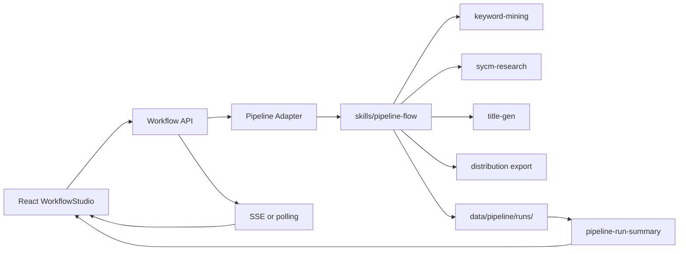

# Executable Workflow Canvas Design

Date: 2026-07-01
Project: ecom-ai-tools

## Purpose

Upgrade `WorkflowStudio` from a development/demo canvas into a real production workflow entry for ecommerce keyword mining, SYCM verification, title/product generation, export, and human review.

The canvas should not become a generic Airflow or Jenkins clone. It should visualize and control this project's existing `pipeline-flow` capabilities, using the same run data that the dashboard already reads.

## Current Problem

The project currently has two workflow systems:

- Real business pipeline: `skills/pipeline-flow`, started by `node bin/cli.js flow daily` or `flow keyword`, persisted under `data/pipeline/runs/<runId>/`.
- Canvas experiment pipeline: `core/workflow` plus `/api/workflows/*`, persisted under `data/workflow/runs`, with a few demo nodes and simulated behavior.

Keeping both will make the product confusing and brittle. The canvas must be aligned with the real pipeline instead of maintaining a separate fake execution model.

## Goals

- Make the canvas a real production entry for running daily or keyword-based workflows.
- Reuse `pipeline-flow` as the execution source of truth.
- Show real node status, output files, logs, blockers, and next actions.
- Support human review and confirmation before any distribution step.
- Keep the system lightweight and local-first.
- Preserve the existing dashboard, mining page, and title page, while making the canvas a first-class orchestrator.

## Non-Goals

- Do not build a general distributed scheduler.
- Do not allow custom JavaScript, Python, or shell code nodes.
- Do not support arbitrary loops or dynamic map-reduce in the first version.
- Do not introduce Redis, BullMQ, Temporal, Airflow, or a database migration in the first version.
- Do not duplicate keyword mining, SYCM, title generation, or export logic inside the canvas.
- Do not submit products automatically without explicit human confirmation.

## Product Shape

The canvas becomes three things at once:

1. A template runner for standard workflows.
2. A live monitor for real pipeline runs.
3. A human decision surface for review, retry, and resume actions.

The first production templates are:

- Daily selection workflow.
- Exact keyword workflow.

The user can configure parameters, run the workflow, inspect each node's real output, and resolve human-action states.

## First-Version User Flow

1. User opens the canvas.
2. User selects a template: daily selection or exact keyword.
3. User edits parameters in the right panel.
4. User clicks run.
5. Backend starts the real `pipeline-flow`.
6. Canvas shows node progress:
   - Mine
   - Verify
   - Generate
   - Export
   - Human Review
   - End
7. User clicks any node to inspect output.
8. If review is required, the Human Review node suspends progress and shows review data.
9. User confirms, rejects, or adjusts review items.
10. Workflow moves to the next safe action.

## Architecture



The canvas should not call the demo `core/workflow/registry` nodes for production runs. `/api/workflows/*` should become an adapter over `pipeline-flow` runs.

## Data Storage

First version keeps file-based storage.

Each production run uses:

```text
data/pipeline/runs/<runId>/
  run.json
  candidates.jsonl
  sycm-results.jsonl
  verified-keywords.jsonl
  generated-products.jsonl
  distribution-batch.txt
  distribution-review.md
  workflow-definition.json
  workflow-events.jsonl
```

`workflow-definition.json` stores the canvas template snapshot and run parameters.

`workflow-events.jsonl` stores lightweight node status events. Large CLI logs should remain in log files or existing run artifacts, not in a database.

## Run Status Model

Workflow-level statuses:

- `created`
- `running`
- `manual_action_required`
- `verified_empty`
- `generated`
- `ready_to_distribute`
- `needs_review`
- `awaiting_user_confirmation`
- `workflow_complete`
- `failed`
- `cancelled`

Node statuses:

- `idle`
- `running`
- `completed`
- `failed`
- `blocked`
- `needs_review`
- `waiting_confirmation`
- `skipped`

The UI maps `pipeline-flow` status into node states. The backend remains the authority.

## Node Types

First-version nodes are fixed and safe:

- Start: input mode and parameters.
- Mine: calls `flow mine` or the mining stage of `flow daily`.
- Verify: calls `flow verify`, including SYCM fallback rules.
- Generate: calls `flow generate`.
- Export: calls `flow export`.
- Human Review: reads `distribution-review.md`, pauses for user confirmation.
- End: shows final status and next action.

Later versions may add:

- Condition node.
- Retry node.
- Distribution-preflight node.
- 1688 distribution node, gated by explicit confirmation.

## API Design

```text
GET  /api/workflows/templates
POST /api/workflows/run
GET  /api/workflows/runs
GET  /api/workflows/runs/:runId
GET  /api/workflows/runs/:runId/events
POST /api/workflows/runs/:runId/cancel
POST /api/workflows/runs/:runId/retry-node
POST /api/workflows/runs/:runId/resume
```

`POST /api/workflows/run` accepts:

```json
{
  "templateId": "daily-selection-v1",
  "mode": "daily",
  "params": {
    "mine": 50,
    "verify": 20,
    "generate": 10,
    "export": 20,
    "productsPerKeyword": 12,
    "length": 60,
    "pages": 1
  }
}
```

Exact keyword mode accepts:

```json
{
  "templateId": "exact-keyword-v1",
  "mode": "keyword",
  "params": {
    "keyword": "纯银项链女高级感",
    "export": 20,
    "productsPerKeyword": 12,
    "length": 60
  }
}
```

## Execution Semantics

First version should use a controlled DAG, not arbitrary free-form graph execution.

The canvas may visually display nodes and edges, but the backend should validate that the submitted graph matches one of the supported templates. This prevents accidental unsupported execution paths.

Execution options:

- Daily workflow maps to `flowDaily`.
- Exact keyword workflow maps to `flowKeyword`.
- Step retry maps to the existing stage-specific commands where possible.

The backend must treat `nextActionCode`, `requiresUserAction`, `blockers`, and `userMessage` as first-class output.

## Human Review

Human review is a blocking production step.

When status is `needs_review` or `awaiting_user_confirmation`:

- The canvas highlights the Human Review node.
- The right panel shows:
  - Recommended Submit
  - Manual Review Candidates
  - Hard Rejected
- The user can confirm the recommended list or remove items.
- The backend writes the approved result and resumes only when it is safe.

No distribution node may run without explicit user confirmation.

## UI Design

Left panel:

- Template list.
- Recent runs.
- Run status filters.

Center canvas:

- Fixed production pipeline templates.
- Node state colors:
  - gray: idle
  - blue: running
  - green: completed
  - red: failed
  - yellow: needs review or waiting confirmation
- Active edge highlighting.

Right panel:

- Before run: node configuration.
- During run: node status, logs, output preview.
- On review node: actionable review table.
- On failure: error, blocker, allowed next command, retry action.

Bottom panel:

- Collapsible event log.
- Keeps recent run events readable without overwhelming the canvas.

## Safety Boundaries

The workflow backend must never execute user-provided shell strings.

Use parameterized `spawn`:

```js
spawn(process.execPath, ['bin/cli.js', 'flow', 'daily', '--mine', String(mine)]);
```

Do not use:

```js
exec(`node bin/cli.js flow daily --mine ${userInput}`);
```

Other boundaries:

- Validate numeric params and clamp ranges.
- Allow only known templates and known node types.
- Allow only one active production workflow unless a later concurrency policy is added.
- Keep credentials in environment variables only.
- Keep logs on disk, not in large database rows.
- Surface browser login, slider, or authorization issues as manual-action states.

## Migration Plan

### Phase 1: Unify Data Source

- Make canvas monitor read `data/pipeline/runs` as the source of truth.
- Mark or remove production access to demo `data/workflow/runs`.
- Add a pipeline-to-canvas node-state mapper.
- Keep existing dashboard behavior unchanged.

### Phase 2: Real Canvas Run

- Change `/api/workflows/run` to start real `pipeline-flow` runs.
- Map canvas params to `flow daily` and `flow keyword`.
- Save `workflow-definition.json`.
- Expose latest run state through `/api/workflows/runs/:runId`.

### Phase 3: Node Output Panels

- Mine node reads `candidates.jsonl`.
- Verify node reads `sycm-results.jsonl` and `verified-keywords.jsonl`.
- Generate node reads `generated-products.jsonl`.
- Export node reads `distribution-batch.txt`.
- Review node reads `distribution-review.md`.

### Phase 4: Human Review and Resume

- Add resume API.
- Allow confirm, reject, and retry actions from the canvas.
- Keep distribution blocked until confirmation.

### Phase 5: Advanced Orchestration

- Add conditional branching.
- Add saved templates.
- Add preflight nodes.
- Add distribution node after confirmation.

## Testing Plan

Unit tests:

- Template validation.
- Pipeline status to node-state mapping.
- Parameter sanitization and clamping.
- Review parsing.
- Resume state transitions.

Integration tests:

- Start daily workflow from `/api/workflows/run`.
- Start exact keyword workflow.
- Simulate `manual_action_required`.
- Simulate `needs_review`.
- Retry failed node.
- Cancel running workflow.

Frontend tests:

- Canvas loads production template.
- Right panel edits params.
- Run button starts workflow.
- Node output panel renders each artifact type.
- Review node blocks and resumes.

Safety tests:

- Injection-like params are rejected or sanitized.
- Unknown node types are rejected.
- Unsupported graph shapes are rejected.

## Acceptance Criteria

- A user can start a real daily selection workflow from the canvas.
- A user can start a real exact keyword workflow from the canvas.
- Canvas and dashboard show the same run state.
- Clicking each node shows real output from the run directory.
- Human review states are actionable from the canvas.
- No production path relies on mock canvas nodes.
- Existing dashboard, mining, and title flows continue to work.

## Key Decision

The long-term direction is to make the canvas the visual production orchestrator for `pipeline-flow`, not a separate workflow product. The first version should favor reliability and clarity over arbitrary flexibility.
